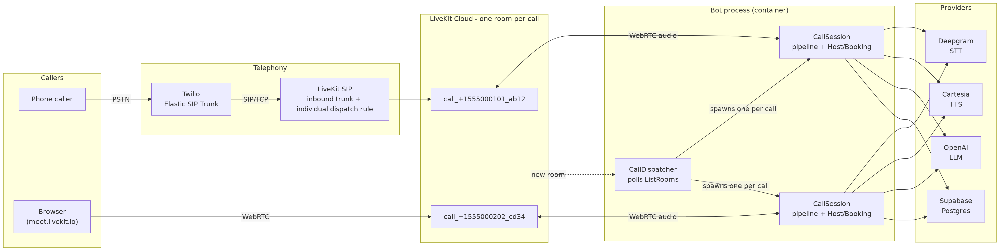
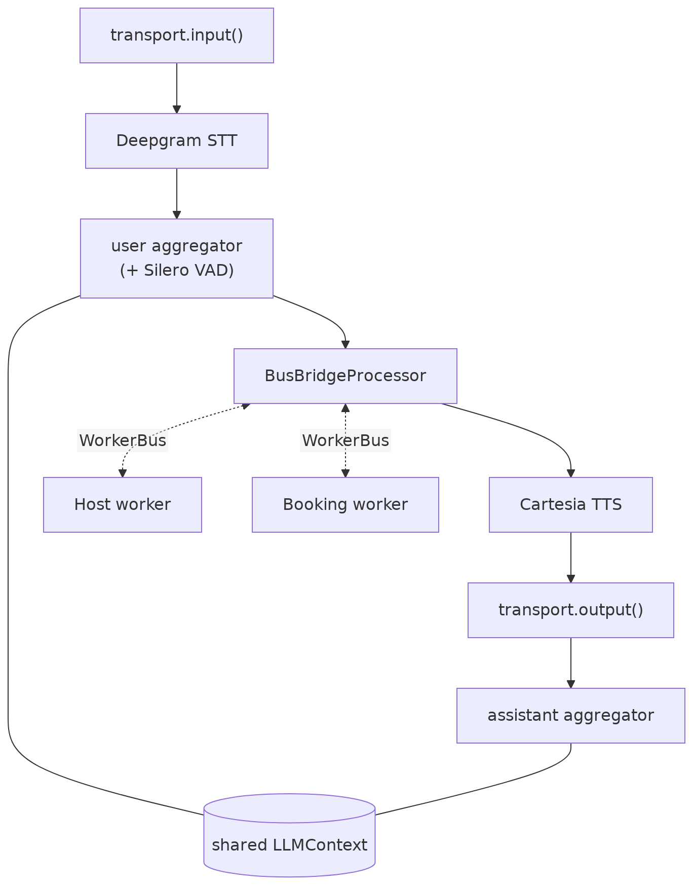
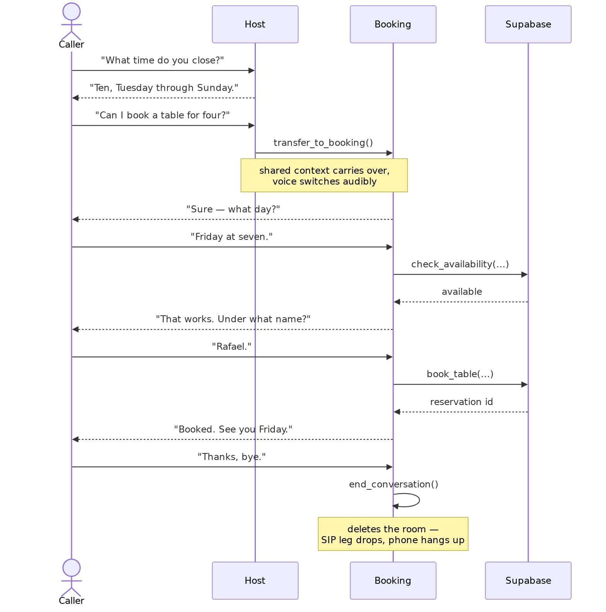
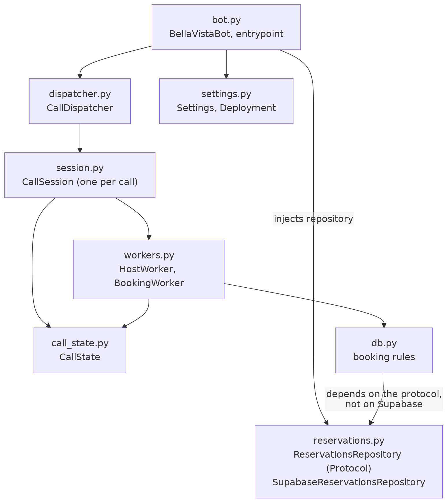
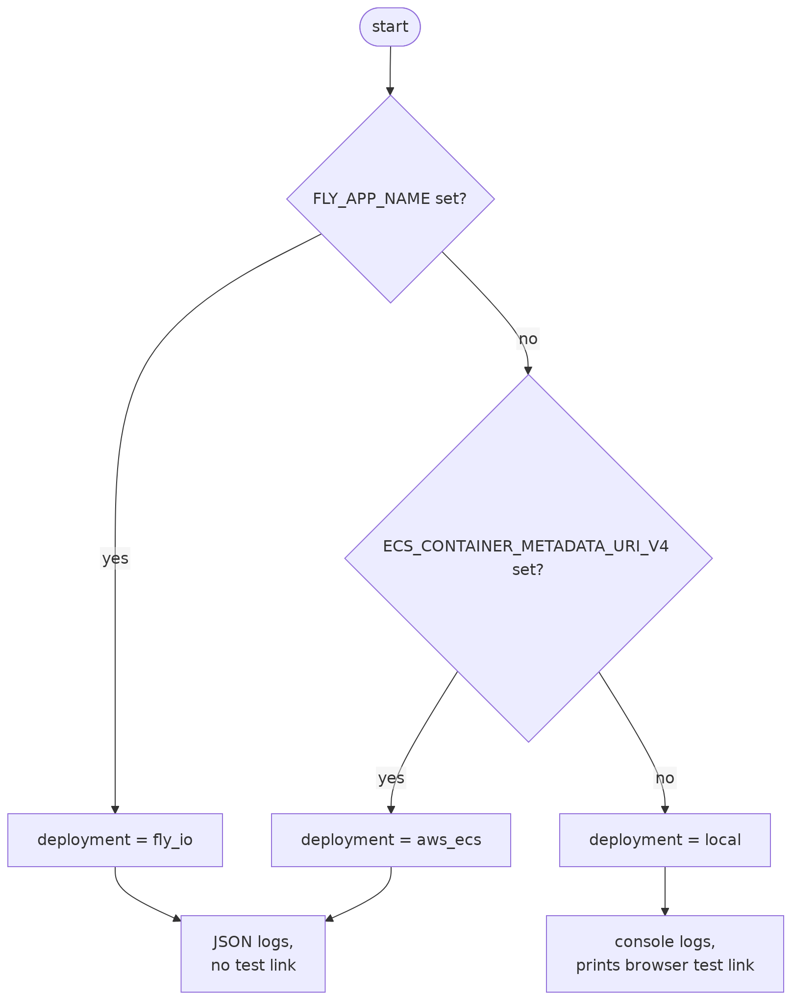

# Bella Vista Voice Bot

A production-shaped voice-agent demo: a restaurant phone line staffed by two
AI agents that hand off to each other mid-conversation, call tools against a
real Postgres backend, and can be reached by dialing an actual phone number.

Built with [Pipecat](https://github.com/pipecat-ai/pipecat) on LiveKit's
native `LiveKitTransport`, with Twilio SIP trunking for PSTN.

- **Host agent** — greets callers, answers questions about the restaurant
  (cuisine, hours, location). No tools. Hands off when a caller wants a table.
- **Booking agent** — owns `check_availability` and `book_table` against
  Supabase. Hands back to the Host for anything unrelated.
- Both can end the call, which hangs up the phone line for real.

## What this demonstrates

| Capability | How |
|---|---|
| Realtime voice pipeline | Deepgram STT → OpenAI LLM → Cartesia TTS over LiveKit WebRTC |
| Barge-in | Silero VAD on the user aggregator — talk over the bot and it stops |
| Tool calling | LLM functions hitting a real Postgres table, not a stub |
| Multi-agent handoff | Two `LLMWorker`s swapping over a `WorkerBus`, one shared context |
| Context retention | Conversation history survives the handoff — the new agent already knows what you said |
| Distinct agent voices | Per-agent TTS voice switching, so a handoff is audible |
| PSTN | Twilio Elastic SIP Trunk → LiveKit SIP → the same room the bot is in |
| Graceful hangup | Ending the call deletes the room, tearing down the SIP leg (and its billing) |
| Observability | Structured JSON audit events + per-turn STT/LLM/TTS latency metrics |

## Architecture



Every inbound call lands in one **fixed room**, and the bot is already sitting
in it. That's what keeps the telephony side purely configuration — no per-call
agent dispatch infrastructure.

## The pipeline

Audio frames flow through a single Pipecat pipeline. The LLM's usual slot is
occupied by a `BusBridgeProcessor`, which routes frames to whichever agent is
currently active and pipes its output back:



The `LLMContext` is created **once** and lives in the main pipeline — the
agents never own their own copy. That's the whole trick behind context
retention: a handoff swaps which LLM is reading the context, so there is no
history to transfer.

## Handoff



A subtlety worth knowing if you extend this: `activate_worker()` is deferred
until the calling tool returns, so the newly-activated agent kicks off its own
first turn from `on_activated()` rather than the handing-off agent doing it.

## Modules



Booking rules depend on a `Protocol`, not on Supabase, so the capacity logic
can be exercised against an in-memory fake without a database.

## Configuration

`Settings` (pydantic-settings) validates all configuration at startup and
fails fast with a single `missing: ...` line rather than a traceback.

The process adapts to where it's running, detected from variables the
platforms inject themselves:



Set `DEPLOYMENT` or `LOG_FORMAT` explicitly to override either.

## Setup

1. Install [uv](https://docs.astral.sh/uv/), then `uv sync`.
2. Copy `.env.example` to `.env` and fill it in (see below).
3. Apply `supabase/migrations/0001_reservations.sql` in the Supabase SQL editor.
4. `uv run bot.py` — it prints a `meet.livekit.io` link you can click to talk
   to the bot in a browser.

### Credentials

| Variable | Where it comes from |
|---|---|
| `LIVEKIT_URL`, `LIVEKIT_API_KEY`, `LIVEKIT_API_SECRET` | [LiveKit Cloud](https://cloud.livekit.io/) → Settings → API Keys |
| `LIVEKIT_ROOM_NAME` | Any fixed name you choose, e.g. `bella-vista-line` |
| `OPENAI_API_KEY` | [OpenAI](https://platform.openai.com/api-keys) (billing must be enabled) |
| `DEEPGRAM_API_KEY` | [Deepgram](https://console.deepgram.com/) (trial credit is plenty) |
| `CARTESIA_API_KEY` | [Cartesia](https://play.cartesia.ai/) → Settings → API Keys |
| `SUPABASE_URL`, `SUPABASE_KEY` | [Supabase](https://supabase.com/dashboard) → Data API, plus the **secret** (`sb_secret_…`) key — not the publishable one |

Optional: `OPENAI_MODEL`, `CARTESIA_VOICE_ID`, `CARTESIA_BOOKING_VOICE_ID`,
`DEPLOYMENT`, `LOG_FORMAT`.

## Phone calls

To dial the bot on a real number:

1. Buy a Voice-capable number on Twilio.
2. Create an Elastic SIP Trunk with an Origination URI of
   `sip:<project-id>.sip.livekit.cloud;transport=tcp`, and attach the number.
   - The SIP subdomain comes from your **Project ID** with the `p_` prefix
     stripped (`lk project list --json`). It is *not* the subdomain in your
     `LIVEKIT_URL`.
   - `;transport=tcp` is required. Without it, calls fail instantly.
3. Create the LiveKit side. `inbound-trunk.json` is a template (the real
   number is never committed) — render it from `.env`'s `TWILIO_PHONE_NUMBER`
   first:
   ```sh
   set -a; source .env; set +a
   envsubst < inbound-trunk.json > inbound-trunk.local.json
   lk sip inbound create inbound-trunk.local.json
   lk sip dispatch create dispatch-rule.json
   ```
   `inbound-trunk.local.json` (gitignored) holds your phone number;
   `dispatch-rule.json` pins every call to `LIVEKIT_ROOM_NAME`. The trunk
   sets a 60s media timeout, since LiveKit otherwise drops calls that go
   quiet.
4. Run the bot, then dial the number.

**Attack surface note:** the inbound trunk's `numbers` list already scopes it
to that one number, but LiveKit doesn't otherwise verify a call actually came
through Twilio rather than a direct SIP request — that requires the
`allowed_addresses` field (restrict to Twilio's signaling IPs), which is
gated behind a LiveKit support request to enable for your project. Worth
requesting before treating this as more than a demo.

## Deployment

```sh
docker build -t bella-vista-bot .
docker run --rm --env-file .env bella-vista-bot
```

The image runs as a non-root user and takes all secrets from the environment
at runtime. On Fly.io or ECS, run exactly **one** instance — this is a single
always-on worker holding one room open, not a horizontally-scalable web
service — and supply the variables above as platform secrets. Logging switches
to JSON automatically.

## Observability

Audit events are emitted as structured fields (`event`, `room`, `participant`,
…), so a log drain can query them instead of grepping text:

`call_started` · `sip_participant_joined` · `handoff` ·
`availability_checked` · `booking_created` · `booking_rejected` ·
`call_ended`

Per-turn STT / LLM / TTS time-to-first-byte and processing times are logged by
Pipecat's `MetricsLogObserver`.

## Notes and limits

- Capacity is a single cap per date+time slot; there's no per-table layout.
- One fixed room means one concurrent call. Concurrency would need per-call
  dispatch, which is the natural next step and a substantially different
  deployment model.
- No automated test suite — each increment was verified by making real calls.
- Pipecat logs the LiveKit access token at INFO on startup; worth silencing
  before running anywhere that ships logs off-box.

## Commands

```sh
uv run bot.py         # run the bot
uv run mypy           # type-check
lk sip inbound list   # verify telephony config
lk room list          # confirm the bot is in the room
```

Diagram sources live in `docs/diagrams/*.mmd`. To regenerate the images after
editing one:

```sh
docker run --rm -u "$(id -u):$(id -g)" -v "$PWD:/data" minlag/mermaid-cli \
  -i /data/docs/diagrams/architecture.mmd \
  -o /data/docs/diagrams/architecture.png \
  -c /data/docs/diagrams/mermaid-config.json -b white -s 2
```
